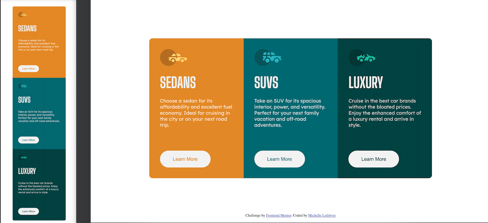

# 3-column-preview-card
Frontend Masters Project #2

# To make all cards the same height
.card {
	height: calc(100vh / 1.9);
}

# Frontend Mentor - 3-column preview card component solution

This is a solution to the [3-column preview card component challenge on Frontend Mentor](https://www.frontendmentor.io/challenges/3column-preview-card-component-pH92eAR2-). Frontend Mentor challenges help you improve your coding skills by building realistic projects. 

## Table of contents

- [Overview](#overview)
  - [The challenge](#the-challenge)
  - [Screenshot](#screenshot)
  - [Links](#links)
- [My process](#my-process)
  - [Built with](#built-with)
  - [What I learned](#what-i-learned)
  - [Useful resources](#useful-resources)
- [Author](#author)

## Overview

### The challenge

Users should be able to:

- View the optimal layout depending on their device's screen size
- See hover states for interactive elements

### Screenshot



### Links

- Solution URL: [https://github.com/Michelle-Lefebvre/3-column-preview-card](https://github.com/Michelle-Lefebvre/3-column-preview-card)
- Live Site URL: [https://mml-3cols-preview-card.netlify.app/](https://mml-3cols-preview-card.netlify.app/)

## My process

### Built with

- Semantic HTML5 markup
- CSS custom properties
- Flexbox
- Mobile-first workflow

### What I learned

To make cards all the same height:

```css
.card {
	height: calc(100vh / 1.9);
}
```

### Useful resources

- [How to Make div Cards of Equal Height with CSS](https://www.youtube.com/watch?v=zBjt5GC1hxk) - This helped me make all the cards equal height.

## Author

- Website - (https://portfolio-mml.netlify.app/)
- Frontend Mentor - [@Michelle-Lefebvre](https://www.frontendmentor.io/profile/Michelle-Lefebvre)
- Twitter - [@MMLdesigns](https://twitter.com/MMLdesigns)
